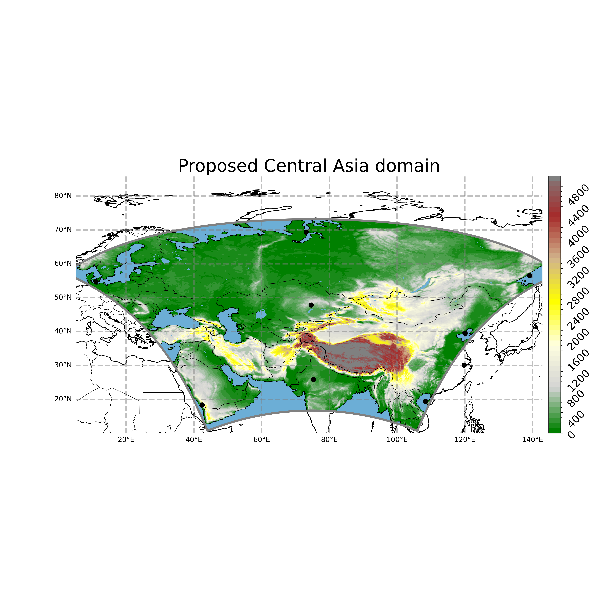

## CACTI WRF Domains

The figure below shows the WRF domain used in CACT: CORDEX Compliant

See our G-Drive here:
https://drive.google.com/drive/folders/1CEwfFy5YqTnjmBgxcz5HxrFIm5G33GmT?usp=drive_link
